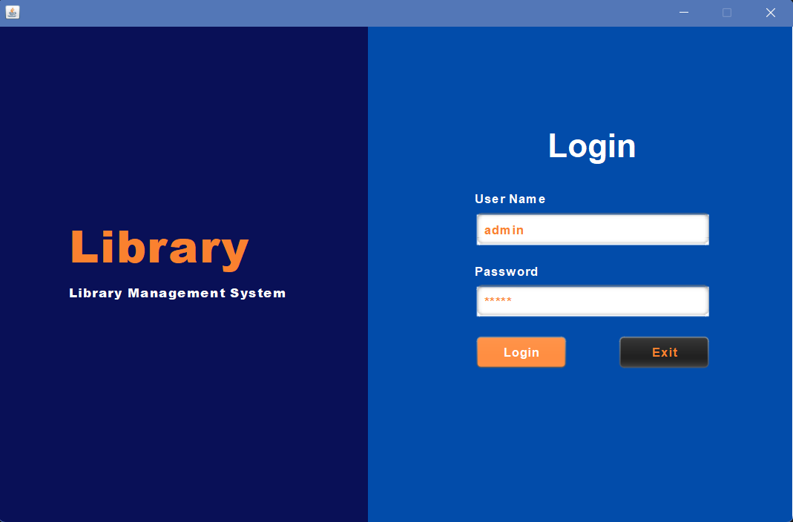

# Library Management System (LMS)

## Project Overview
The Library Management System (LMS) is a robust Java-based application designed to streamline library operations through an intuitive graphical user interface. Developed as part of the Advanced Technological Institute Kandy's Information Technology program, this project demonstrates advanced software engineering principles and object-oriented programming techniques.

## Key Features
- 🔐 Secure Login System
  - Separate access levels for Admin and Members
  - Role-based authentication and privileges
- 📚 Comprehensive Book Management
  - Add, update, delete, and search books
  - Multiple search methods (by title, by title and author)
  - Detailed book information tracking
- 👥 Member Management
  - Full member lifecycle management
  - Membership card tracking
  - Admin-controlled member operations

## Screenshots

### Login Screen


### Book Management


### Edit Book


### Member Management


### Edit Member


### Issued Books


### Returned Books


## Technical Specifications
### Architecture
- **Design Pattern:** Model-View-Controller (MVC)
- **Layers:**
  - Model Layer: Data and business logic
  - View Layer: User interface components
  - Controller Layer: Interaction management

### Object-Oriented Programming Concepts
1. **Encapsulation**
   - Private fields with public getters and setters
   - Data protection in Book, Member, and MembershipCard classes
2. **Inheritance**
   - User class as a base for Admin and Member classes
   - Code reusability and hierarchical design
3. **Polymorphism**
   - Method overriding (e.g., `displayDetails()`)
   - Flexible method implementations
4. **Abstraction**
   - Clean separation of concerns
   - Interfaces and abstract classes for common behaviors
5. **Aggregation & Composition**
   - Loose coupling between Books and Members
   - Strong relationship with MembershipCard

### Exception Handling
- Robust error management for:
  - Invalid login attempts
  - Empty form submissions
  - Unauthorized access scenarios

## Prerequisites
- Java Development Kit (JDK) 8 or higher
- NetBeans IDE (recommended)
- Basic understanding of Java and OOP concepts

## Installation
1. Clone the repository
   ```bash
   git clone https://github.com/Thisara404/library-management-system.git
   ```
2. Open the project in NetBeans
3. Resolve dependencies
4. Build and run the application

## Usage
### Login
- Launch the application
- Enter username and password
- Access features based on role (Admin/Member)

### Admin Capabilities
- Manage Members
  - Add new members
  - Update member details
  - Activate/Deactivate memberships
- Manage Books
  - Add new books
  - Update book information
  - Delete books
  - Track issued books

### Member Capabilities
- Search books
- View book details

## Future Enhancements
- Database integration for data persistence
- Advanced search capabilities
- Reporting features
- Online reservation system

## Contributing
1. Fork the repository
2. Create your feature branch
3. Commit your changes
4. Push to the branch
5. Create a Pull Request

## License
This project is licensed under the MIT License.

## Contact
- T.D Thumpalage
- 0789854096
- Advanced Technological Institute Kandy
- Department of Information Technology

## Acknowledgments
- NetBeans IDE
- Java Swing for GUI components
